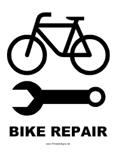

# Gestión Taller de Bicicletas

App Taller de Bicicletas es una aplicación creada en java mediante el entorno de desarrollo de NetBeans 1.9 que gestiona 
piezas, proveedores y reparaciones.

Utiliza la tecnología Hibernate para el mapeo de objetos y la persistencia de datos con MySql.

## Funcionamiento de la aplicación
[Ver vídeo tutorial](https://youtu.be/ijC9FcQF27I)
